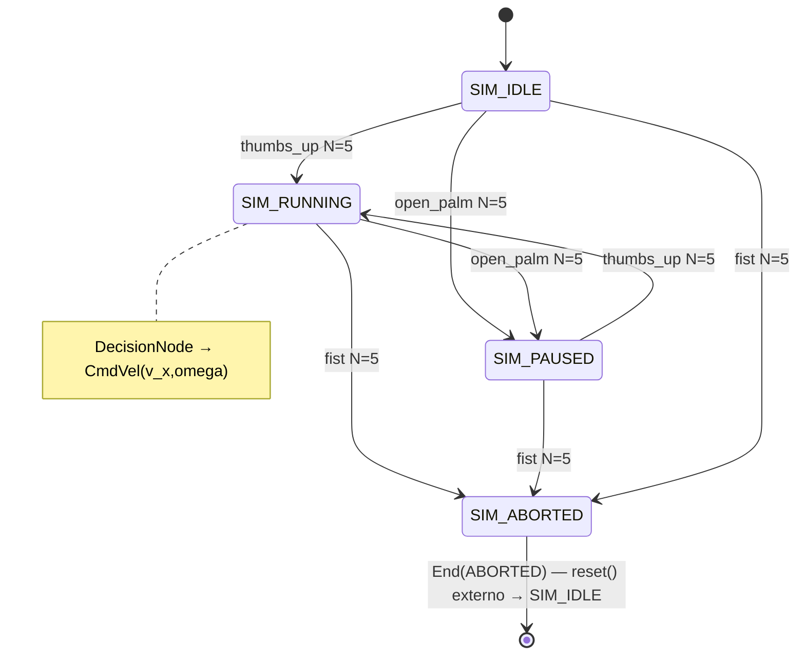

# Ticket 009 — Grilling: Estados y transiciones del StateGraph

> Label: `wayfinder:grilling` · Parent: `001-map-orchestrador-sim.md` · Estado: cerrado · Resolución: 2026-08-22

## Resolución

**Decisión HITL Q1-Q4 (grilling+domain-modeling 2026-08-22):**

- **Q1 Set 4 estados** — `SIM_IDLE` (reposo, `CmdVel(0,0)`), `SIM_RUNNING` (ejecutando), `SIM_PAUSED` (`open_palm` N=5, `CmdVel(0,0)`), `SIM_ABORTED` como **`End[data=ABORTED]` terminal en `pydantic-graph`** (parada emergencia, requiere `reset()` externo que recrea `MissionState`). Simetría exacta `MissionFSM`.
- **Q2 Mapping idéntico** — `thumbs_up N=5→SIM_RUNNING`, `open_palm N=5→SIM_PAUSED`, `fist N=5→SIM_ABORTED`, `none`/`conf<0.7`=no-op. Reusa `handle_gesto` pura `CONTEXT.md:59` y `fsm.py:43` histéresis determinística. Aborto inmediato sin histéresis delegado a `Safety Envelope` futuro (fog), no a FSM.
- **Q3 Híbrido FSM-gated** — FSM muta `ctx.state.estado` reactiva; `DecisionNode(Agent[HardwareContext,DecisionAgentica])` solo corre si `state==SIM_RUNNING` para calcular `CmdVel` (reduce costo tokens). `ABORTED`/`PAUSED` saltan LLM y retornan `End`/`SIM_PAUSED`. Testeable con `TestModel` sin red.
- **Q4 Histéresis none=no-op** — `label==none` o `conf<0.7` resetea contador N=5, no transiciona. `TickNode` siempre `ctx.state.frame_id+=1` + `adapter.step(100ms)` aunque sin gesto → loop 10Hz determinístico.

**Artefactos (spec para 010/011/012):**

| Estado \ Evento | `thumbs_up` N=5 | `open_palm` N=5 | `fist` N=5 | `none`/low conf | `tick` (no gesto) |
|---|---|---|---|---|---|
| `SIM_IDLE` | `SIM_RUNNING` + `Decision→CmdVel` | `SIM_PAUSED` + `CmdVel(0,0)` | `SIM_ABORTED` (End) | stay + no-op | `frame_id++` |
| `SIM_RUNNING` | stay `SIM_RUNNING` + `Decision→CmdVel` | `SIM_PAUSED` + `CmdVel(0,0)` | `SIM_ABORTED` (End) | stay | `Decision→CmdVel→step` |
| `SIM_PAUSED` | `SIM_RUNNING` + `Decision→CmdVel` | stay | `SIM_ABORTED` (End) | stay | `frame_id++` |
| `SIM_ABORTED` | stay (latch, ignora) | stay | stay | stay | no-op hasta `reset()` |

- Headless test: `GestoReconocido(thumbs_up N=5)→RUNNING→CmdVel(0.5)→pose avanza`, `fist N=5→ABORTED→CmdVel(0,0)` incluso si LLM propone `avanzar`.

> Estado previo: abierto · Bloqueado por 008 · HITL → desbloquea 012 (parcial)

## Question

¿Tabla de estados y transiciones del orquestador que consume `GestoReconocido` y produce `CmdVel`?

Decidir (grilling + domain-modeling):
- ¿Reusar `ABORTED` latch + `PAUSED`/`RUNNING` (`CONTEXT.md:59` `handle_gesto` N=5) + nuevos `SIM_IDLE`/`SIM_MOVING`, o grafo mínimo desacoplado `IDLE → EXECUTING → DONE`?
- ¿`thumbs_up` confirma qué transición? ¿`fist`→`ABORTED`, `open_palm`→`PAUSED`, `thumbs_up`→`RUNNING` como en `plataforma/webcam/frontend/src/main.js:85` o mapping distinto para sim?
- ¿Quién decide la transición: `StateGraph` puro o `DecisionAgentica` (Muse Spark) vía `Grammar-Constrained Decoding`? ¿Híbrido (gesto → estado, LLM → `CmdVel` param)?
- ¿Histéresis N=5 se mantiene para `SimObservation` o solo gestos? ¿Tiempo `T_onset`?
- Edge cases: gesto `none`/`conf<0.7`, multi-gesto, `ABORTED` ignora todo hasta `reset()` — ¿igual en sim?
- Salida: diagrama + tabla `Estado × Evento → NuevoEstado + CmdVel` testeable headless con `TestModel`.

Bloqueado por 008 (librería StateGraph define forma del diagrama). Desbloquea 012.

## Bloquea

- 012-grilling-integracion-safety
